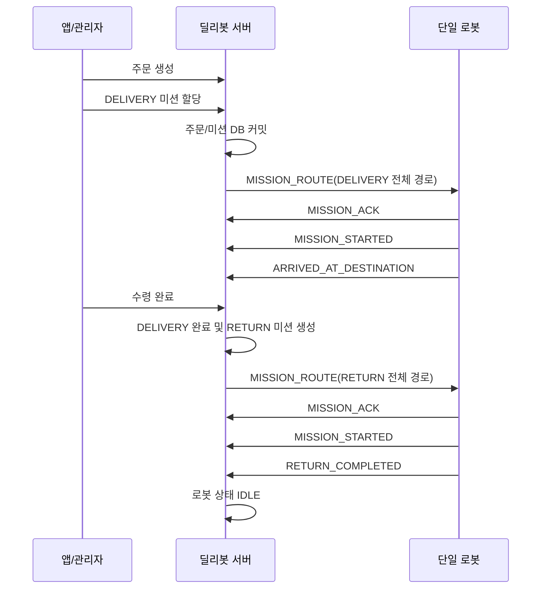

# 딜리봇 배송 서버

Spring Boot 기반의 캠퍼스 단일 로봇 배송 서버입니다.

앱 또는 관리자 화면에서 주문을 생성하고 배송 미션을 할당하면, 서버가 캠퍼스 경로를 계산하여 WebSocket으로 로봇에 전달합니다. 배송 완료 후 사용자의 수령 완료 요청이 들어오면 별도의 복귀 미션을 생성하여 로봇을 베이스로 복귀시킵니다.

## 핵심 설계

- 시스템은 **단일 로봇**만 사용합니다.
- 외부 API와 WebSocket 메시지에 `robotId`를 사용하지 않습니다.
- 배송 경로와 복귀 경로를 하나의 왕복 경로로 합치지 않습니다.
- 배송은 `DELIVERY`, 복귀는 `RETURN` 미션으로 각각 DB에 저장합니다.
- 사용자의 수령 완료 요청 전에는 `RETURN` 미션을 생성하지 않습니다.
- 서버는 waypoint를 하나씩 보내지 않고, **전체 경로를 하나의 `MISSION_ROUTE` 메시지로 전송**합니다.
- 미션을 DB에 커밋한 뒤 경로를 전송하므로, 로봇이 즉시 ACK를 보내도 미션을 조회할 수 있습니다.
- 로봇이 연결되지 않아도 미션은 `CREATED` 상태로 저장됩니다.
- 로봇이 다시 WebSocket에 연결하면 아직 전송하지 않은 `CREATED` 미션을 전송합니다.
- 수령 완료 요청이 중복되어도 주문별 `RETURN` 미션은 하나만 생성됩니다.

## 기술 스택

- Java 17
- Spring Boot 3.3.5
- Spring Web / Validation
- Spring WebSocket
- Spring Data JPA
- H2 Database
- Maven
- Leaflet / OpenStreetMap

## 실행 방법

Java 17과 Maven이 설치된 환경에서 다음 명령을 실행합니다.

```bash
mvn spring-boot:run
```

기본 서버 주소는 다음과 같습니다.

```text
http://localhost:8080
```

다른 PC 또는 로봇에서 접속할 때는 `localhost` 대신 서버 PC의 내부 IP 주소를 사용해야 합니다.

```text
http://<서버-PC-IP>:8080
ws://<서버-PC-IP>:8080/ws/robot
```

## 사용 가능한 웹페이지

| 페이지 | URL | 용도 |
| --- | --- | --- |
| 주문 현황 | `http://localhost:8080/total` | 주문 조회, 상태 변경, 배송 미션 할당, 로봇 위치 확인 |
| 로봇 테스트 | `http://localhost:8080/robot-test.html` | WebSocket 연결, 가상 배송 경로 전송, 로봇 이벤트 전송 |
| H2 Console | `http://localhost:8080/h2-console` | 주문, 미션, 로봇 상태 DB 확인 |

H2 Console 접속 정보:

```text
JDBC URL: jdbc:h2:file:C:/Users/Public/Documents/ESTsoft/CreatorTemp/order-db
User Name: sa
Password: 비워 두기
```

DB 파일은 다음 위치에 생성됩니다.

```text
C:/Users/Public/Documents/ESTsoft/CreatorTemp/order-db.mv.db
```

## 전체 배송 흐름



## 상태 전이

### 주문 상태

```text
WAITING -> DELIVERING -> COMPLETED
```

### 배송 미션 상태

```text
CREATED -> DISPATCHED -> ACKED -> IN_PROGRESS -> ARRIVED -> COMPLETED
```

- `CREATED`: DB에는 저장됐지만 아직 로봇에 전송되지 않음
- `DISPATCHED`: 경로가 로봇에 전송됨
- `ACKED`: 로봇이 경로 수신을 확인함
- `IN_PROGRESS`: 로봇이 이동을 시작함
- `ARRIVED`: 배송 목적지에 도착함
- `COMPLETED`: 사용자가 물건을 수령함
- `FAILED`: 로봇이 미션 실패를 보고함
- `CANCELED`: 취소된 미션을 표현하기 위한 상태

### 복귀 미션 상태

일반적인 흐름:

```text
CREATED -> DISPATCHED -> ACKED -> IN_PROGRESS -> COMPLETED
```

복귀 완료 시 로봇은 `RETURN_COMPLETED` 이벤트를 전송합니다. 필요하다면 베이스 도착 시 `ARRIVED_AT_DESTINATION`을 먼저 보내고 `RETURN_COMPLETED`를 이어서 보낼 수도 있습니다.

### 로봇 상태

```text
IDLE -> DELIVERY_ASSIGNED -> BUSY -> RETURNING -> IDLE
```

| 시점 | 로봇 상태 |
| --- | --- |
| 초기 상태 | `IDLE` |
| DELIVERY 미션 생성 | `DELIVERY_ASSIGNED` |
| DELIVERY ACK 또는 시작 | `BUSY` |
| 배송 목적지 도착 | `BUSY` |
| 사용자 수령 완료 및 RETURN 생성 | `RETURNING` |
| RETURN ACK 또는 시작 | `RETURNING` |
| 복귀 완료 | `IDLE` |

`IDLE`이 아닌 상태에서는 새로운 배송 미션을 할당할 수 없으며 HTTP `409 Conflict`가 반환됩니다.

## 캠퍼스 경로

`CampusMapService`가 `RouteService`를 구현하며, 캠퍼스 노드와 양방향 간선을 기반으로 최단 경로를 계산합니다. 간선 거리는 GPS 좌표 사이의 Haversine 거리로 계산합니다.

기본 베이스 노드는 `info_a`, 기본 배송 목적지는 `social_science_front`입니다.

| 노드 ID | 위치 | 위도 | 경도 |
| --- | --- | ---: | ---: |
| `library_front` | 도서관 앞 | 37.375226 | 126.633868 |
| `info_a` | 정보대 A동 | 37.374528 | 126.633170 |
| `info_b` | 정보대 B동 | 37.374806 | 126.633435 |
| `social_convention_intersection` | 사과대/컨벤션 교차로 | 37.375606 | 126.633185 |
| `social_science_front` | 사과대 앞 | 37.376190 | 126.633746 |
| `convention_front` | 컨벤션 앞 | 37.375258 | 126.632858 |
| `convention_near` | 컨벤션 인근 | 37.374917 | 126.632551 |
| `natural_science` | 자연대 | 37.375556 | 126.634128 |

전체 캠퍼스 맵 조회:

```http
GET /api/campus-map
```

최단 경로 조회:

```http
GET /api/campus-map/routes?from=info_a&to=social_science_front
```

PowerShell에서 호출할 때는 `&` 문자가 명령 구분자로 해석되지 않도록 URL을 따옴표로 감쌉니다.

```powershell
curl.exe "http://localhost:8080/api/campus-map/routes?from=info_a&to=social_science_front"
```

## 주문 API

| Method | Endpoint | 설명 |
| --- | --- | --- |
| `POST` | `/api/orders` | 앱 주문 생성 |
| `GET` | `/api/orders/{orderId}` | 주문 상세 조회 |
| `GET` | `/api/orders/{orderId}/status` | 주문 상태와 최신 로봇 위치 조회 |
| `GET` | `/api/orders/{orderId}/stream` | 주문 변경 SSE 구독 |
| `GET` | `/api/admin/orders` | 전체 주문 조회 |
| `GET` | `/api/admin/orders/{orderId}` | 관리자 주문 상세 조회 |
| `POST` | `/api/admin/orders` | 관리자 주문 생성 |
| `PUT` | `/api/admin/orders/{orderId}` | 주문 정보 수정 |
| `PATCH` | `/api/admin/orders/{orderId}/status` | 주문 상태 변경 |
| `DELETE` | `/api/admin/orders/{orderId}` | 주문 삭제 |

주문 생성 예시:

```http
POST /api/orders
Content-Type: application/json
```

```json
{
  "customerName": "테스트 사용자",
  "phoneNumber": "010-1111-2222",
  "deliveryAddress": "social_science_front",
  "items": [
    {
      "name": "생수",
      "quantity": 1,
      "unitPrice": 1000
    }
  ]
}
```

## 배송 미션 API

### DELIVERY 미션 할당

```http
POST /api/orders/{orderId}/assign-robot
Content-Type: application/json
```

```json
{
  "fromNodeId": "info_a",
  "destinationNodeId": "social_science_front"
}
```

- 요청 본문은 생략할 수 있습니다.
- `fromNodeId`를 생략하면 `info_a`를 사용합니다.
- `destinationNodeId`를 생략하면 주문의 `deliveryAddress`가 캠퍼스 노드인 경우 해당 노드를 사용합니다.
- 주문 주소가 캠퍼스 노드가 아니면 기본 목적지 `social_science_front`를 사용합니다.
- 주문 상태가 `WAITING`이고 로봇 상태가 `IDLE`일 때만 할당할 수 있습니다.
- 로봇이 연결되어 있지 않아도 미션은 저장되며 응답의 `robotConnected`가 `false`가 됩니다.

응답 구조 예시(설명을 위해 waypoint 한 건만 표시):

```json
{
  "mission": {
    "missionId": "4a58f29e-79cf-477f-8b30-e2c543197e6a",
    "orderId": "d39ac0ad-b88d-4cd6-94ea-61090286e24f",
    "type": "DELIVERY",
    "status": "CREATED",
    "fromNodeId": "info_a",
    "toNodeId": "social_science_front",
    "waypoints": [
      {
        "sequence": 1,
        "latitude": 37.374528,
        "longitude": 126.633170
      }
    ]
  },
  "robotConnected": false,
  "dispatchMessage": "Mission saved, but robot is not connected."
}
```

실제 `waypoints`에는 계산된 전체 GPS 경로가 포함됩니다.

### 수령 완료 및 RETURN 미션 생성

```http
POST /api/orders/{orderId}/received
Content-Type: application/json
```

```json
{
  "message": "사용자 수령 완료"
}
```

처리 조건과 결과:

- DELIVERY 미션 상태가 `ARRIVED` 또는 이미 `COMPLETED`여야 합니다.
- DELIVERY 미션을 `COMPLETED`로 변경합니다.
- 주문 상태를 `COMPLETED`로 변경합니다.
- 배송 목적지에서 베이스 `info_a`까지의 `RETURN` 미션을 새로 생성합니다.
- 기존 RETURN 미션이 있으면 새 미션을 만들지 않고 기존 미션을 반환합니다.

### 미션과 로봇 상태 조회

| Method | Endpoint | 설명 |
| --- | --- | --- |
| `GET` | `/api/missions` | 전체 미션 조회 |
| `GET` | `/api/missions?orderId={orderId}` | 주문별 DELIVERY/RETURN 미션 조회 |
| `GET` | `/api/missions/{missionId}` | 미션 상세 조회 |
| `GET` | `/api/robot/status` | 단일 로봇 상태와 현재 미션 ID 조회 |
| `POST` | `/api/robot/missions/events` | REST 방식 미션 이벤트 전송 |

## WebSocket 로봇 연동

### 연결 주소

서버 PC에서 로봇 프로그램을 실행하는 경우:

```text
ws://localhost:8080/ws/robot
```

로봇과 서버가 서로 다른 장치인 경우:

```text
ws://<서버-PC-IP>:8080/ws/robot
```

이 시스템은 단일 논리 로봇을 사용하므로 연결 URL이나 메시지에 `robotId`를 넣지 않습니다.

테스트 페이지와 실제 로봇이 동시에 연결되어 있으면 서버는 연결된 모든 세션에 동일한 미션 경로를 전송합니다.

### 서버에서 로봇으로 보내는 메시지

서버는 전체 경로를 다음 `MISSION_ROUTE` 메시지 하나로 전송합니다.

```json
{
  "messageType": "MISSION_ROUTE",
  "missionId": "4a58f29e-79cf-477f-8b30-e2c543197e6a",
  "orderId": "d39ac0ad-b88d-4cd6-94ea-61090286e24f",
  "missionType": "DELIVERY",
  "fromNodeId": "info_a",
  "toNodeId": "social_science_front",
  "waypoints": [
    {
      "sequence": 1,
      "latitude": 37.374528,
      "longitude": 126.633170
    },
    {
      "sequence": 2,
      "latitude": 37.374917,
      "longitude": 126.632551
    },
    {
      "sequence": 3,
      "latitude": 37.375258,
      "longitude": 126.632858
    },
    {
      "sequence": 4,
      "latitude": 37.375606,
      "longitude": 126.633185
    },
    {
      "sequence": 5,
      "latitude": 37.376190,
      "longitude": 126.633746
    }
  ]
}
```

로봇은 `sequence` 오름차순으로 waypoint를 주행합니다. 서버가 다음 waypoint를 개별적으로 보내는 방식이 아닙니다.

### 로봇에서 서버로 보내는 메시지

로봇은 수신한 `missionId`를 변경하지 않고 모든 이벤트에 그대로 포함해야 합니다.

```json
{
  "messageType": "MISSION_ACK",
  "missionId": "4a58f29e-79cf-477f-8b30-e2c543197e6a",
  "currentWaypointSequence": 1,
  "latitude": 37.374528,
  "longitude": 126.633170,
  "message": "경로 수신 완료"
}
```

지원 이벤트:

| `messageType` | 적용 대상 | 서버 처리 |
| --- | --- | --- |
| `MISSION_ACK` | DELIVERY / RETURN | 미션을 `ACKED`로 변경 |
| `MISSION_STARTED` | DELIVERY / RETURN | 미션을 `IN_PROGRESS`로 변경 |
| `ARRIVED_AT_DESTINATION` | 주로 DELIVERY | 미션을 `ARRIVED`로 변경 |
| `RETURN_COMPLETED` | RETURN만 가능 | RETURN 완료 및 로봇을 `IDLE`로 변경 |
| `MISSION_FAILED` | DELIVERY / RETURN | 미션을 `FAILED`로 변경 |

`currentWaypointSequence`, `latitude`, `longitude`, `message`는 선택 값입니다. 위도와 경도를 함께 보내면 서버의 최신 로봇 위치도 갱신됩니다.

WebSocket에서는 `messageType` 대신 `eventType` 필드도 허용하지만, 로봇 연동 규격은 `messageType` 사용을 권장합니다.

정상 처리 응답:

```json
{
  "messageType": "MISSION_EVENT_ACCEPTED",
  "missionId": "4a58f29e-79cf-477f-8b30-e2c543197e6a",
  "status": "ACKED"
}
```

오류 응답:

```json
{
  "messageType": "ERROR",
  "message": "missionId is required."
}
```

REST로 동일한 미션 이벤트를 보낼 때는 `messageType` 대신 `eventType`을 사용합니다.

```http
POST /api/robot/missions/events
Content-Type: application/json
```

```json
{
  "missionId": "4a58f29e-79cf-477f-8b30-e2c543197e6a",
  "eventType": "MISSION_STARTED",
  "currentWaypointSequence": 1,
  "latitude": 37.374528,
  "longitude": 126.633170,
  "message": "주행 시작"
}
```

## 로봇 개발자 연동 체크리스트

1. `ws://<서버-PC-IP>:8080/ws/robot`에 연결합니다.
2. 외부 메시지에 `robotId`를 추가하지 않습니다.
3. `MISSION_ROUTE` 한 건에 들어 있는 전체 `waypoints`를 저장합니다.
4. `sequence` 오름차순으로 주행합니다.
5. 경로를 정상 수신하면 같은 `missionId`로 `MISSION_ACK`를 보냅니다.
6. 이동을 시작하면 `MISSION_STARTED`를 보냅니다.
7. DELIVERY 목적지에 도착하면 `ARRIVED_AT_DESTINATION`을 보냅니다.
8. 배송 도착 후 로봇이 스스로 베이스로 복귀하지 않고 `RETURN` 경로를 기다립니다.
9. 서버에서 `missionType: "RETURN"` 경로를 받으면 같은 방식으로 ACK와 시작 이벤트를 보냅니다.
10. 베이스 복귀를 마치면 RETURN 미션 ID로 `RETURN_COMPLETED`를 보냅니다.
11. 연결이 끊기면 재연결합니다. 서버는 아직 전송하지 않은 `CREATED` 미션을 연결 직후 다시 전송합니다.
12. 이벤트를 보낼 때는 가장 최근에 수신한 현재 미션의 `missionId`를 사용합니다.

## 로봇 위치와 경로 이벤트 API

최신 위치 저장:

```http
POST /api/robot/location
Content-Type: application/json
```

```json
{
  "latitude": 37.374806,
  "longitude": 126.633435
}
```

최신 위치 조회:

```http
GET /api/robot/location
```

기존 경로 이벤트 형식을 사용하는 클라이언트는 다음 API도 사용할 수 있습니다.

```http
POST /api/robot/route-events
GET /api/robot/route-events
GET /api/robot/route-events?commandId={commandId}
```

지원 경로 이벤트 상태:

```text
ACCEPTED | MOVING | WAYPOINT_REACHED | ARRIVED | FAILED | CANCELED
```

`commandId`가 미션 UUID이면 해당 이벤트가 미션 이벤트로도 변환됩니다.

| 경로 이벤트 | 미션 이벤트 |
| --- | --- |
| `ACCEPTED` | `MISSION_ACK` |
| `MOVING`, `WAYPOINT_REACHED` | `MISSION_STARTED` |
| `ARRIVED` | `ARRIVED_AT_DESTINATION` |
| `FAILED`, `CANCELED` | `MISSION_FAILED` |

## 테스트용 가상 배송

테스트 API는 테스트 주문과 DELIVERY 미션을 자동으로 생성한 뒤 경로 전송을 시도합니다.

```http
POST /api/robot/test-routes/delivery
Content-Type: application/json
```

```json
{
  "fromNodeId": "info_a",
  "destinationNodeId": "social_science_front"
}
```

`/robot-test.html`에서 다음 순서로 전체 흐름을 확인할 수 있습니다.

1. `Connect`
2. `Send Virtual DELIVERY Route`
3. `Send ACK`
4. `Send STARTED`
5. `Send ARRIVED`
6. `Send RETURN Route After Received`
7. RETURN 경로 수신 확인
8. `Send ACK`
9. `Send STARTED`
10. `Send RETURN COMPLETED`
11. `/api/robot/status`에서 `IDLE` 확인

테스트 페이지 버튼 설명:

| 버튼 | 동작 |
| --- | --- |
| `Connect` | 입력된 WebSocket 주소로 연결 |
| `Disconnect` | 현재 WebSocket 연결 종료 |
| `Send Virtual DELIVERY Route` | 테스트 주문과 DELIVERY 미션 생성 |
| `Load Current Mission` | 현재 로봇 상태와 미션 ID 조회 |
| `Send RETURN Route After Received` | 현재 주문을 수령 완료 처리하고 RETURN 미션 생성 |
| `Send ACK` | 현재 미션에 `MISSION_ACK` 전송 |
| `Send STARTED` | 현재 미션에 `MISSION_STARTED` 전송 |
| `Send ARRIVED` | 현재 미션에 `ARRIVED_AT_DESTINATION` 전송 |
| `Send RETURN COMPLETED` | 현재 RETURN 미션 완료 처리 |
| `Send Custom JSON` | 입력한 JSON을 WebSocket으로 직접 전송 |
| `Clear Log` | 화면 로그 삭제 |

## DB 저장과 경로 전송 순서

미션 경로는 다음 순서로 처리됩니다.

1. 주문, 미션, 로봇 상태를 DB 트랜잭션에 저장합니다.
2. 트랜잭션 커밋을 완료합니다.
3. 별도 트랜잭션에서 미션을 `DISPATCHED`로 변경합니다.
4. WebSocket으로 `MISSION_ROUTE`를 전송합니다.

따라서 로봇이 경로를 받자마자 같은 `missionId`로 ACK를 보내도 서버에서 미션을 찾을 수 있습니다.

로봇이 연결되어 있지 않으면 1단계의 DB 저장은 그대로 완료되고 미션은 `CREATED` 상태로 남습니다. 이후 WebSocket 연결 시 대기 중인 미션을 전송합니다.

## 오류 응답

REST API 오류는 `ProblemDetail` 형식으로 반환됩니다.

```json
{
  "type": "about:blank",
  "title": "Robot unavailable",
  "status": 409,
  "detail": "Robot cannot accept a new delivery while status is RETURNING.",
  "instance": "/api/robot/test-routes/delivery"
}
```

주요 오류:

| HTTP 상태 | 제목 | 원인 |
| --- | --- | --- |
| `400` | `Invalid mission state` | 잘못된 미션 상태에서 이벤트 또는 수령 완료 요청 |
| `400` | `Validation failed` | 필수 필드 누락 또는 값 형식 오류 |
| `404` | `Order not found` | 존재하지 않는 주문 ID |
| `404` | `Mission not found` | 존재하지 않는 미션 ID |
| `404` | `Campus map node not found` | 존재하지 않는 캠퍼스 노드 |
| `409` | `Robot unavailable` | 로봇이 `IDLE`이 아닌 상태에서 신규 배송 할당 |

## 문제 해결

### 로봇에 메시지가 도착하지 않는 경우

- 실제 로봇이 `ws://<서버-PC-IP>:8080/ws/robot`에 연결되어 있는지 확인합니다.
- 로봇이 다른 장치라면 `localhost`를 사용하지 않습니다.
- 서버와 로봇이 같은 네트워크에 있는지 확인합니다.
- Windows 방화벽에서 TCP `8080` 포트 접근을 허용합니다.
- `GET /api/robot/status`와 서버 로그를 확인합니다.
- 먼저 `/robot-test.html`에서 서버 자체 WebSocket 전송이 정상인지 확인합니다.

### 브라우저 CSP 오류가 발생하는 경우

Bing, MSN 같은 다른 사이트의 개발자 콘솔에서 WebSocket 연결 코드를 실행하면 해당 사이트의 CSP 정책에 의해 차단될 수 있습니다.

다음 페이지를 직접 열어서 테스트합니다.

```text
http://localhost:8080/robot-test.html
```

### `missionId is required` 오류

- `MISSION_ROUTE`에서 받은 `missionId`가 이벤트에 들어 있는지 확인합니다.
- 테스트 페이지에서는 먼저 가상 DELIVERY 경로를 보내거나 `Load Current Mission`을 실행합니다.
- 빈 문자열 `""`을 보내면 안 됩니다.

### `Robot unavailable` 오류

현재 로봇 상태가 `DELIVERY_ASSIGNED`, `BUSY`, `RETURNING` 중 하나이면 새 배송을 시작할 수 없습니다.

```http
GET /api/robot/status
```

현재 미션 흐름을 완료하여 로봇이 `IDLE`로 돌아오도록 해야 합니다. 시연 데이터를 완전히 초기화해야 한다면 서버를 먼저 종료한 뒤 H2 DB 파일을 삭제하고 다시 실행합니다.

```powershell
Remove-Item -LiteralPath "C:\Users\Public\Documents\ESTsoft\CreatorTemp\order-db.mv.db"
Remove-Item -LiteralPath "C:\Users\Public\Documents\ESTsoft\CreatorTemp\order-db.trace.db" -ErrorAction SilentlyContinue
```

DB 파일 삭제 시 기존 주문과 미션 데이터가 모두 사라집니다.

## 테스트

전체 자동 테스트:

```bash
mvn test
```

현재 포함된 주요 미션 테스트:

- 주문 할당 시 DELIVERY 미션 생성
- 수령 완료 시 RETURN 미션 생성
- 로봇이 BUSY일 때 신규 배송 할당 거부
- 로봇 이벤트에 따른 미션 상태 변경
- WebSocket 미연결 상태에서도 미션 DB 저장
- 중복 수령 완료 요청 시 RETURN 미션 중복 생성 방지
- DB 커밋 후 경로 전송 보장
- 캠퍼스 최단 경로와 존재하지 않는 노드 오류 처리

## 주요 패키지

```text
src/main/java/com/example/orderserver
├── config       WebSocket 설정
├── controller   REST API, WebSocket Handler, DTO 매핑
├── domain       주문, 미션, 로봇, 캠퍼스 경로 엔티티와 상태
├── dto          요청/응답 및 WebSocket 메시지
├── exception    도메인 예외
├── repository   JPA Repository
└── service      주문, 미션, 경로, 로봇 통신 서비스
```

핵심 확장 지점:

- `RouteService`: 실제 주행 경로 엔진으로 교체 가능
- `RobotCommandGateway`: MQTT, ROS 2 또는 별도 메시지 브로커로 교체 가능

